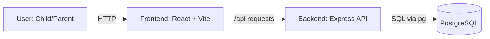

# Outside Today

## App Summary
Outside Today helps families encourage kids to spend more time outdoors through structured, fun activities. The app addresses a common issue where children default to screen-based entertainment and need guidance toward active play. The primary user is a child, supported by a parent who sets goals and rewards. Kids can browse outdoor activities, complete challenges, and earn points over time. Parents can use points and goals to reinforce healthy habits and celebrate progress. This repository now includes a backend and database foundation so progress can persist instead of resetting on refresh. The first vertical slice connects one real button to database updates and UI feedback.

## Tech Stack
- Frontend: React 18, TypeScript, Vite, Tailwind CSS, shadcn/ui, Framer Motion
- Backend: Node.js, Express
- Database: PostgreSQL
- Database Access: `pg` (node-postgres)
- Authentication: Not implemented yet (planned for future milestones)
- Tooling: ESLint, Vitest, Nodemon
- External services/APIs: None currently

## Architecture Diagram


## Prerequisites
Install the following software before running locally:
- Node.js 18+ and npm: https://nodejs.org/en/download
- PostgreSQL 14+ and `psql`: https://www.postgresql.org/download/

Verify installations:
```bash
node -v
npm -v
psql --version
```

## Installation and Setup
1. Install dependencies:
```bash
npm install
```
2. Create environment file:
```bash
cp .env.example .env
```
3. Create the PostgreSQL database:
```bash
createdb outside_today
```
4. Run schema and seed scripts:
```bash
psql -d outside_today -f db/schema.sql
psql -d outside_today -f db/seed.sql
```

## Running the Application
Start backend in terminal 1:
```bash
npm run dev:server
```
Start frontend in terminal 2:
```bash
npm run dev
```
Open the app at:
- Frontend URL: `http://localhost:8080`
- Backend health check: `http://localhost:3001/api/health`

## Verifying the Vertical Slice
This milestone wires the existing `Start Activity ⭐` button on the Activities page to the backend and database.

1. Open `http://localhost:8080/activities`.
2. Click any activity card to open the detail panel.
3. Click `Start Activity ⭐` and confirm the popup says: `Activity begun! Return here once complete to claim your points!`.
4. Click `Verify Completion`.
5. Confirm the UI updates with a success message and a new `Activity Points` value.
6. Refresh the page and confirm `Activity Points` still shows the updated total from PostgreSQL.
7. Confirm rows were written in PostgreSQL:
```bash
psql -d outside_today -c "SELECT completion_id, child_id, points_earned, completed_at FROM completed_activities ORDER BY completion_id DESC LIMIT 5;"
psql -d outside_today -c "SELECT child_id, total_points FROM children WHERE child_id = 1;"
```

## Database Scripts
- Schema: `db/schema.sql`
- Seed data: `db/seed.sql`

The schema includes at least 5 tables and currently defines:
- `users`
- `children`
- `activities`
- `goals`
- `completed_activities`
- `rewards`
- `activity_suggestions`
- `screen_time`

## Team Repository Note
Share this repository with all team members and invite GitHub user `taforlauracutler` as required by the assignment.
